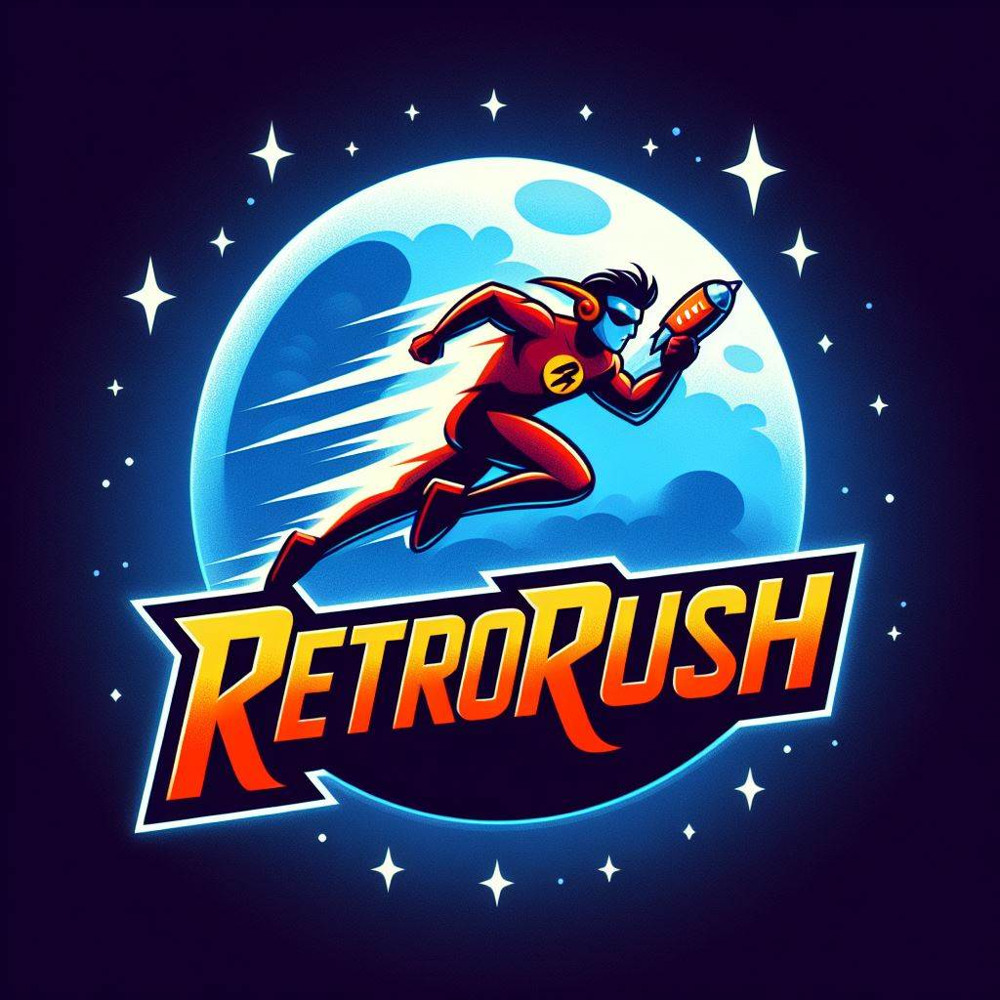

 <h1>PACMAN 1980 - RETRORUSH</h1>

<!-- Short Description of the Game -->
   <h2>Introduction.</h2>
   
Pac-Man is a classic arcade game developed by Toru Iwatani and released by Namco in 1980. The game features a yellow character navigating a maze, eating pellets, and avoiding ghosts. It's a timeless, iconic game that has left a significant mark on pop culture. Our team has created a small tribute to this legendary classic.       

   

    

  <!-- Team Photo -->
 <h2>Retrorush</h2> 

   
    
<!-- Main Contributions of Each Team Member -->
  <h2>Team Member</h2>

   <ul>
        <li>
            <strong>Lluc Cid Bernal</strong>: Design / QA / Code / Art / Project Management   
           
             
            <a href="https://github.com/Lluccib">GitHub Profile</a>
        </li>
        <li>
            <strong>Claudia Ruiz Muñoz</strong>: Design / QA / Code / Art / Project Management    
            
             
            <a href="https://github.com/cla4d1a">GitHub Profile</a>
        </li>
    <!-- Add more team members and their contributions as necessary -->
    </ul>
<!-- Embedded Gameplay Video -->
<h2>Gameplay Video</h2>
<iframe width="560" height="315" src="https://www.youtube.com/embed/Scq4P5gn4A" frameborder="0" allow="autoplay; encrypted-media" allowfullscreen></iframe>
    
 
<!-- Replace VIDEO_ID with the actual ID of your YouTube video -->

<!-- Download Link for Latest Release -->
   <h2>Latest Release</h2>
   Download the latest release of Pac-Man Tribute <a href="https://github.com/Lluccib/PacMan--RetroRush/releases/tag/Pacman_V.1.0">here</a>.

   <!-- Additional Information or Credits -->
   This project is a tribute to the original Pac-Man game released in 1980.
   Special thanks to UPC for their support.

    
